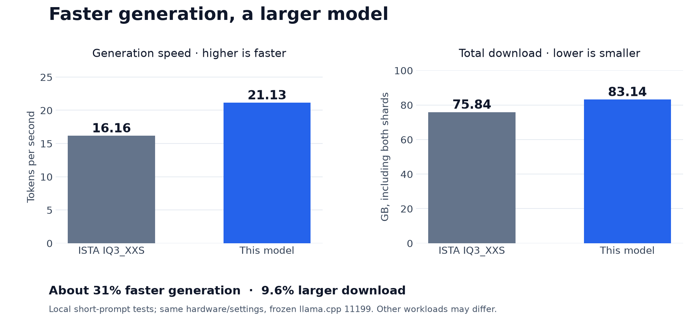
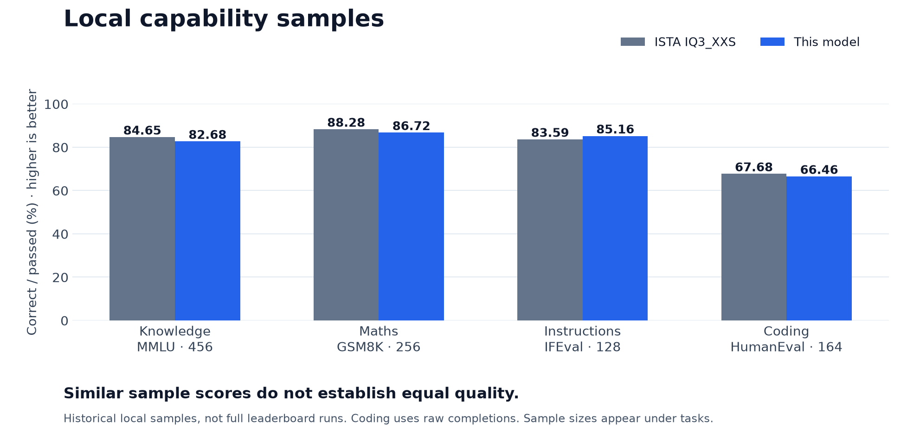

# Qwen3.8 Flash Next · Abliterated GSQ-RCO-based GGUF

**An experimental text-generation model for research purposes.** Combines ISTA's compressed weights with freshly quantized weights from an abliterated checkpoint.

## Overview

On the tested machine, this model generated **about 31% faster** than untouched ISTA IQ3_XXS, with a **9.6% larger download**. Similar scores on small samples do not establish equal quality.

“Mixed precision” means different parts use different compression levels. `IQ3_XXS` in the filenames identifies the source variant; it is not every tensor's format. This is **GSQ-RCO-based**, not a fresh GSQ/RCO optimization of every layer.

## Available files

| File | Contents | Size |
|---|---|---:|
| `…-00001-of-00002.gguf` | Main model weights | 54.34 GB |
| `…-00002-of-00002.gguf` | N-gram lookup table | 28.80 GB |
| **Both shards** | **Required together** | **83.14 GB** |

Sizes use decimal GB. Text only; no vision or MTP draft weights. Download size is not RAM usage. Lazy loading reads the lookup table as needed; use an SSD and leave memory for the runtime and conversation cache. Some tests left only 2–4 GiB available RAM.

## Performance



Latest short tests: **21.13 versus 16.16 generated tokens/s**. Hardware: i7-12700K, RTX 5070 Ti 16 GB, 64 GB RAM and NVMe. Both used llama.cpp 11199 / `86a24a182`, 12 threads, 43 CPU MoE layers, lazy loading, Q8_0/Q5_1 cache and flash attention. Runs generated 512 tokens from short prompts, with control batches before and after the baselines. Other hardware and long-conversation speeds are unknown.

## Results



| Local sample | ISTA IQ3_XXS | This model |
|---|---:|---:|
| Knowledge — MMLU, 456 questions | 84.65% | 82.68% |
| Maths — GSM8K, 256 questions | 88.28% | 86.72% |
| Instructions — strict IFEval, 128 prompts | 83.59% | 85.16% |
| Coding — raw HumanEval, 164 tasks | 67.68% | 66.46% |

Historical fixed local samples, not full leaderboard scores. The three-task average excluding coding changed by **−0.66 percentage points** (95% interval: **−2.79 to +1.41**); equal quality remains unproven. Coding uses raw completions, without the formatting adjustment. See [evaluation notes](EVALUATION-NOTES.md).

## Usage

Keep both shards together; llama.cpp opens the second automatically. Use a compatible build supporting this architecture and lazy lookup loading.

```text
llama-cli -m "Qwen3.8-Flash-Next-Abliterated-GSQ-RCO-IQ3_XXS-Calibrated-00001-of-00002.gguf" -ngl 999 -ncmoe 43 --lazy-mode on -c 16384 -t 12 -ctk q8_0 -ctv q5_1 -fa on -b 512 -ub 128 -rea off --reasoning-budget 0 -p "Explain how a rainbow forms." -n 256 --single-turn
```

This example uses 12 threads, 43 CPU MoE layers and 16K allocated context, matching the tested machine. Adjust for other hardware. Build 11454 / `462524043` passed a short generation check; its speed was not compared. Populated long-context validation remains outstanding.

## Quantization procedure

1. Retain **1,078 ISTA tensors** with their existing GSQ-RCO quantization.
2. Freshly quantize **146 edited BF16 tensors** from [windowsxp811203's abliterated checkpoint](https://huggingface.co/windowsxp811203/Qwen3.8-Flash-Next-Abliterated): 98 Q8_0, 46 IQ4_NL and two Q2_0.
3. Use calibration and targeted refinement to select precision, then correct and verify the GGUF layout.

[AtomicChat's recipe](https://huggingface.co/AtomicChat/Qwen3.8-Flash-Next-GGUF) inspired expert-down formats and selective precision. We used [its calibration corpus](https://huggingface.co/datasets/AtomicChat/calib-corpora), not its model weights. All 1,224 tensors passed byte verification. [PROVENANCE.json](PROVENANCE.json) records sources and hashes; portable full reproduction is unfinished.

## Research use and license

**For research purposes.** Ablation changes behaviour; the name does not guarantee unrestricted responses, accuracy or safety. Independently evaluate outputs before relying on them.

Credits: [Qwen](https://huggingface.co/Qwen/Qwen3.8-Flash-Next), [ISTA-DASLab](https://huggingface.co/ISTA-DASLab/Qwen3.8-Flash-Next-GSQ-RCO-GGUF), [GSQ](https://github.com/IST-DASLab/GSQ), windowsxp811203, AtomicChat and [llama.cpp](https://github.com/ggml-org/llama.cpp). Retain [Qwen Community License 1.0](LICENSE) and [attribution](ATTRIBUTION.md).
